# Multi-Agent Insurance System - Architecture Design

## 1. System Overview

The Multi-Agent Insurance System is a collaborative agent-based architecture that leverages specialized AI agents to research and synthesize insurance policy information. The system uses CrewAI's built-in orchestration to manage agent coordination and task sequencing.

## 2. High-Level Architecture

```mermaid
graph TB
    Client[Client Application] --> API[API Gateway]
    API --> Crew[CrewAI Crew<br/>Built-in Orchestration]
    Crew --> Researcher[Researcher Agent]
    Crew --> Writer[Writer Agent]
    Researcher --> LLM[Ollama LLM]
    Writer --> LLM
    Researcher --> CrawlAPI[Crawl API]
    Researcher --> DB[(MongoDB<br/>Database)]
    Writer --> DB
    Crew --> StateManager[State Manager<br/>Optional]
    StateManager --> DB
```

## 3. Component Architecture

## 4. Agent Communication Flow

## 5. Data Flow Architecture

## 6. Technology Stack

| Layer | Technology |
|-------|-----------|
| Framework | CrewAI, LangChain |
| LLM | Ollama |
| Database | MongoDB |
| External API | Crawl API |
| Language | Python |
| State Management | Custom State Manager |

## 7. Key Design Principles

1. **Agent Specialization**: Each agent has a distinct role and responsibility
2. **CrewAI Orchestration**: Built-in task sequencing and agent coordination
3. **Task Dependencies**: CrewAI automatically handles data flow between tasks via context
4. **State Logging**: Optional state manager for monitoring and audit trails
5. **Fault Tolerance**: CrewAI's built-in error handling with optional custom retry logic

