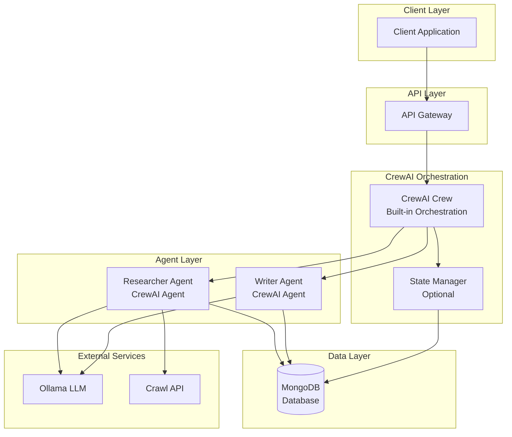
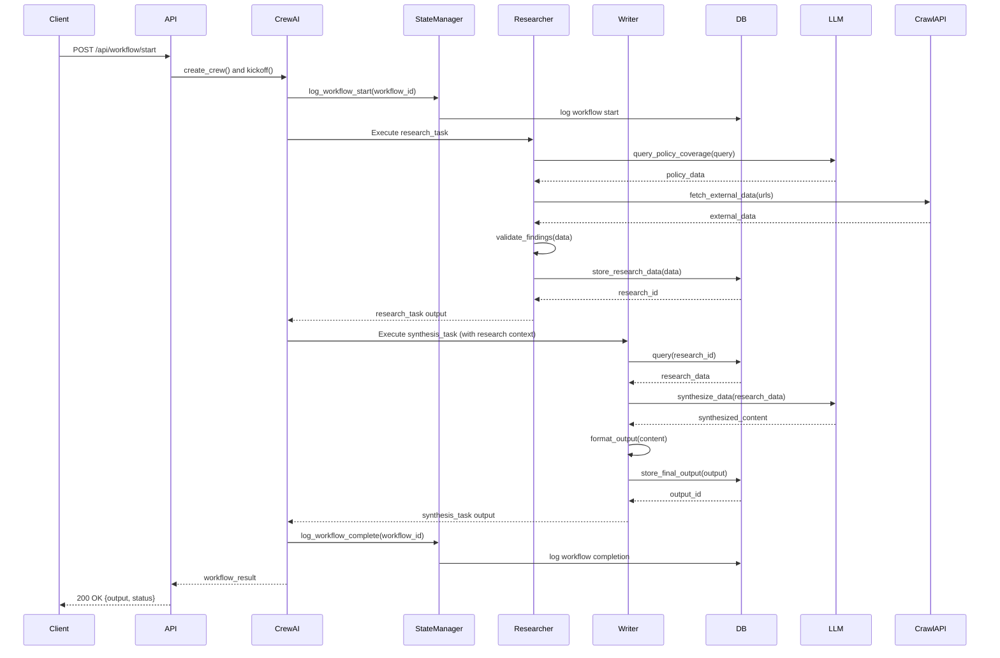
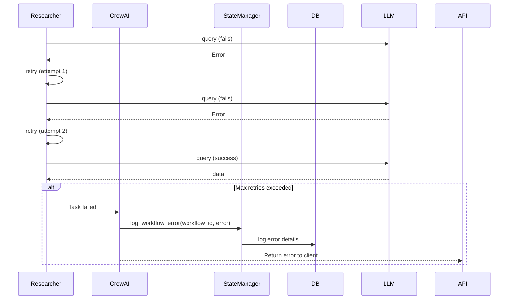
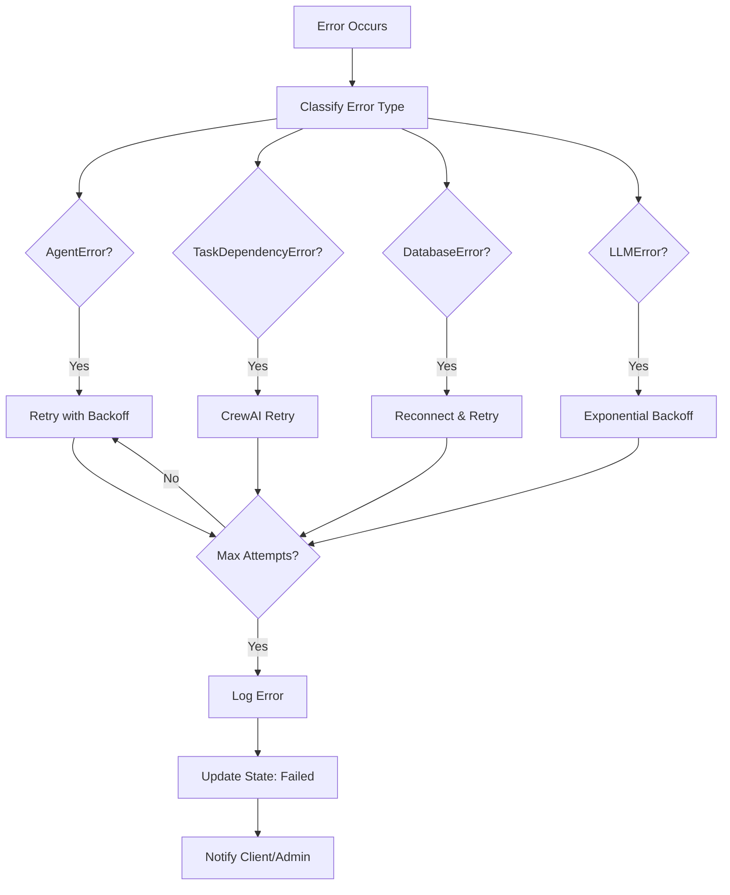

# Multi-Agent Insurance System - Low-Level Design (LLD)

## 1. Introduction

### 1.1 Purpose
This Low-Level Design (LLD) document provides detailed specifications for the Multi-Agent Insurance System. The system implements a collaborative architecture featuring specialized AI agents that work together to research and synthesize insurance policy information. CrewAI's built-in orchestration manages agent coordination and task sequencing.

### 1.2 Scope
This document covers:
- System architecture and component design
- Agent specifications and interactions
- Database schema and data models
- Workflow orchestration and sequence flows
- Error handling mechanisms
- Technology stack and configuration

### 1.3 System Overview
The system consists of two specialized agents:
- **Researcher Agent**: Sources policy coverage information from LLM and external APIs
- **Writer Agent**: Synthesizes and formats research data into structured outputs

These agents are coordinated by CrewAI's built-in orchestration, which manages task sequencing and automatically handles data flow between tasks through task dependencies.

## 2. System Architecture Diagram



## 3. Module Design

### 3.1 CrewAI Crew Module

**Purpose**: Orchestrates agents and tasks using CrewAI's built-in capabilities

**Responsibilities**:
- Define agent roles and tasks
- Manage task dependencies and sequencing
- Coordinate agent execution
- Handle workflow execution

**Class Structure**:
```python
from crewai import Crew, Agent, Task

class InsuranceCrew:
    - researcher_agent: Agent
    - writer_agent: Agent
    - research_task: Task
    - synthesis_task: Task
    - crew: Crew
    - state_manager: StateManager  # Optional
    
    + create_crew() -> Crew
    + execute_workflow(request: WorkflowRequest) -> WorkflowResult
    + get_workflow_status(workflow_id: str) -> dict
```

**CrewAI Configuration**:
```python
# CrewAI handles orchestration automatically
crew = Crew(
    agents=[researcher_agent, writer_agent],
    tasks=[research_task, synthesis_task],
    verbose=True,
    process=Process.sequential  # Tasks execute in sequence
)

result = crew.kickoff(inputs={"query": "Health insurance coverage"})
```

### 3.2 State Manager Module (Optional)

**Purpose**: Optional workflow state tracking and logging

**Responsibilities**:
- Log workflow execution for monitoring
- Store workflow metadata
- Track workflow status (optional, CrewAI handles execution)

**Class Structure**:
```python
class StateManager:
    - db_client: DatabaseClient
    
    + log_workflow_start(workflow_id: str, query: str) -> bool
    + log_workflow_complete(workflow_id: str, result: dict) -> bool
    + log_workflow_error(workflow_id: str, error: Exception) -> bool
    + get_workflow_log(workflow_id: str) -> dict
```

**Note**: CrewAI handles task sequencing and agent coordination. State Manager is optional and used only for logging/monitoring purposes.

### 3.3 Database Client Module

**Purpose**: MongoDB database operations interface

**Responsibilities**:
- Provide unified interface for MongoDB operations
- Handle connection management and connection pooling
- Manage collections and indexes

**Class Structure**:
```python
class DatabaseClient:
    - client: MongoClient
    - database: Database
    - connection_string: str
    
    + connect(connection_string: str) -> bool
    + disconnect() -> None
    + insert(collection: str, data: dict) -> str
    + query(collection: str, filter: dict) -> List[dict]
    + update(collection: str, id: str, data: dict) -> bool
    + delete(collection: str, id: str) -> bool
    + create_index(collection: str, fields: List[str]) -> bool
    + get_collection(collection: str) -> Collection
```

### 3.4 Task Dependency Management

**Purpose**: Define task dependencies using CrewAI's built-in mechanism

**How it works**: CrewAI automatically handles task sequencing through task dependencies. The Writer task depends on the Research task, ensuring proper execution order.

**Task Configuration**:
```python
# Research task
research_task = Task(
    description="Research policy coverage for {query}",
    agent=researcher_agent,
    expected_output="Structured research data with policy coverage information"
)

# Synthesis task (depends on research_task)
synthesis_task = Task(
    description="Synthesize research into structured output",
    agent=writer_agent,
    context=[research_task],  # CrewAI handles hand-off automatically
    expected_output="Formatted insurance policy report"
)
```

**Note**: CrewAI's `context` parameter automatically passes data from previous tasks to dependent tasks, eliminating the need for a custom hand-off protocol.

### 3.5 API Gateway Module

**Purpose**: Expose RESTful API endpoints

**Responsibilities**:
- Handle HTTP requests
- Validate input
- Create and execute CrewAI Crew
- Return responses

**Endpoints**:
```
POST /api/workflow/start
    Request: { "query": str, "parameters": dict }
    Response: { "workflow_id": str, "status": str, "result": dict }

GET /api/workflow/{workflow_id}/status
    Response: { "status": str, "progress": str }  # From State Manager logs

GET /api/workflow/{workflow_id}/result
    Response: { "output": dict, "status": str }

DELETE /api/workflow/{workflow_id}
    Response: { "success": bool }
```

**Implementation**:
```python
@app.post("/api/workflow/start")
def start_workflow(request: WorkflowRequest):
    crew = InsuranceCrew()
    result = crew.execute_workflow(request)
    return {"workflow_id": result.workflow_id, "status": "completed", "result": result}
```

## 4. Agent Design

### 4.1 Researcher Agent

**Purpose**: Sources and gathers insurance policy information

**Key Responsibilities**:
- Query LLM for policy coverage information
- Use Crawl API for external data retrieval
- Validate and structure research findings
- Store intermediate results in database

**CrewAI Agent Structure**:
```python
from crewai import Agent
from langchain_community.llms import Ollama

researcher_agent = Agent(
    role="Insurance Policy Researcher",
    goal="Research and gather comprehensive insurance policy coverage information",
    backstory="Expert researcher specializing in insurance policies, coverage details, and policy analysis",
    llm=Ollama(model="llama2", temperature=0.7),
    tools=[policy_search_tool, web_crawler_tool, validation_tool],
    verbose=True,
    allow_delegation=False
)
```

**Tools**:
- **Policy Coverage Search Tool**: Queries Ollama LLM for policy-specific information
- **Web Crawler Tool**: Fetches data from external sources via Crawl API
- **Data Validation Tool**: Validates and structures research findings

**Task Definition**:
```python
research_task = Task(
    description="Research insurance policy coverage for: {query}. Gather information from LLM and external sources.",
    agent=researcher_agent,
    expected_output="Structured research data with policy coverage information, sources, and confidence scores"
)
```

### 4.2 Writer Agent

**Purpose**: Synthesizes and formats research data into structured output

**Key Responsibilities**:
- Synthesize information from research task output
- Format output according to specifications
- Store final structured output

**CrewAI Agent Structure**:
```python
from crewai import Agent
from langchain_community.llms import Ollama

writer_agent = Agent(
    role="Insurance Policy Writer",
    goal="Synthesize research data into well-structured, formatted insurance policy reports",
    backstory="Expert writer specializing in creating clear, comprehensive insurance policy documentation",
    llm=Ollama(model="llama2", temperature=0.5),
    tools=[synthesis_tool, formatting_tool, quality_check_tool],
    verbose=True,
    allow_delegation=False
)
```

**Tools**:
- **Data Synthesis Tool**: Combines and synthesizes research findings
- **Output Formatting Tool**: Formats output according to specifications
- **Quality Check Tool**: Validates output quality and completeness

**Task Definition**:
```python
synthesis_task = Task(
    description="Synthesize the research data into a structured insurance policy report. Format it clearly with sections for coverage, limits, exclusions, and recommendations.",
    agent=writer_agent,
    context=[research_task],  # Automatically receives research_task output
    expected_output="Formatted insurance policy report"
)
```

### 4.3 Agent Communication via CrewAI

**CrewAI Task Context**: CrewAI automatically passes task outputs as context to dependent tasks. No custom hand-off protocol needed.

**Task Output Flow**:
```python
# Research task output becomes available to Writer task
research_output = {
    "research_id": str,
    "research_data": dict,
    "sources": List[str],
    "confidence_score": float
}

# Writer task receives this automatically via context parameter
# No manual hand-off required - CrewAI handles it
```

## 5. Sequence Flow

### 5.1 Complete Workflow Sequence



### 5.2 Error Handling Sequence



## 6. Database Design

### 6.1 Database Schema

#### 6.1.1 Workflow States Collection

**MongoDB Collection**: `workflow_states`

```python
{
    "workflow_id": str,  # Primary Key / _id
    "status": str,  # "researching", "writing", "completed", "failed"
    "current_agent": str,
    "research_data": dict,
    "synthesis_data": dict,
    "metadata": {
        "query": str,
        "parameters": dict,
        "created_by": str
    },
    "error_log": List[dict],
    "created_at": datetime,
    "updated_at": datetime
}
```

**Indexes**:
- `workflow_id` (unique)
- `status`
- `created_at`

#### 6.1.2 Research Data Collection

**MongoDB Collection**: `research_data`

```python
{
    "research_id": str,  # Primary Key / _id
    "workflow_id": str,  # Foreign Key
    "query": str,
    "policy_coverage_data": {
        "coverage_types": List[str],
        "limits": dict,
        "exclusions": List[str],
        "premium_info": dict
    },
    "external_data": [
        {
            "source": str,
            "url": str,
            "content": str,
            "extracted_at": datetime
        }
    ],
    "sources": List[str],
    "confidence_score": float,
    "created_at": datetime
}
```

**Indexes**:
- `research_id` (unique)
- `workflow_id`
- `created_at`

#### 6.1.3 Final Outputs Collection

**MongoDB Collection**: `final_outputs`

```python
{
    "output_id": str,  # Primary Key / _id
    "workflow_id": str,  # Foreign Key
    "research_id": str,  # Foreign Key
    "synthesized_content": str,
    "formatted_output": {
        "summary": str,
        "detailed_coverage": dict,
        "recommendations": List[str],
        "metadata": dict
    },
    "quality_metrics": {
        "completeness": float,
        "accuracy": float,
        "readability": float
    },
    "created_at": datetime
}
```

**Indexes**:
- `output_id` (unique)
- `workflow_id`
- `research_id`
- `created_at`

### 6.2 Data Relationships

```
workflow_states (1) ----< (N) research_data
workflow_states (1) ----< (N) final_outputs
research_data (1) ----< (1) final_outputs
```

### 6.3 Database Configuration

**Selected Database**: MongoDB

**Rationale**:
- **Flexible Schema**: Natural fit for document-oriented data with nested structures
- **Document Storage**: Ideal for storing workflow states, research data, and outputs as JSON documents
- **Simple Relationships**: Efficient handling of foreign key references (workflow_id, research_id)
- **Performance**: Fast read/write operations for document queries
- **Scalability**: Horizontal scaling support for high-volume workflows
- **Python Integration**: Excellent PyMongo library with seamless LangChain/CrewAI integration

**Connection Configuration**:
```python
DATABASE_CONFIG = {
    "type": "mongodb",
    "host": "localhost",
    "port": 27017,
    "database": "insurance_agents",
    "connection_pool_size": 100
}
```

## 7. Technology Stack

| Layer | Technology | Version/Purpose |
|-------|-----------|----------------|
| **Framework** | CrewAI | Agent orchestration and management |
| **Framework** | LangChain | LLM integration and tooling |
| **LLM** | Ollama | Local LLM inference |
| **Database** | MongoDB | Document storage and workflow state management |
| **External API** | Crawl API | Web scraping and data extraction |
| **Language** | Python | 3.9+ |
| **API Framework** | FastAPI / Flask | REST API implementation |
| **State Management** | Custom State Manager | Workflow state persistence |
| **Caching** | Redis (optional) | State caching and performance |

### 7.1 Dependencies

```python
# Core Dependencies
crewai>=0.1.0
langchain>=0.1.0
langchain-community>=0.0.20
ollama>=0.1.0

# Database Driver
pymongo>=4.6.0  # MongoDB

# API Framework
fastapi>=0.104.0
uvicorn>=0.24.0

# Utilities
pydantic>=2.0.0
python-dotenv>=1.0.0
```

## 8. Error Handling Strategy

### 8.1 Error Types and Classification

| Error Type | Description | Severity | Recovery Strategy |
|------------|-------------|----------|-------------------|
| **AgentError** | Agent-specific failures (LLM timeout, tool error) | High | Retry with exponential backoff, max 3 attempts |
| **TaskDependencyError** | CrewAI task dependency failures | Critical | Log error, CrewAI handles retry, notify admin |
| **DatabaseError** | Database operation failures (connection, query) | High | Retry with connection pool, fallback to cache |
| **LLMError** | LLM API failures (rate limit, model error) | Medium | Exponential backoff, switch model if available |
| **ValidationError** | Data validation failures | Medium | Return error to client, log for review |
| **NetworkError** | External API failures (Crawl API timeout) | Medium | Retry with circuit breaker pattern |

### 8.2 Error Handling Flow



### 8.3 Retry Strategy

**Exponential Backoff Configuration**:
```python
RETRY_CONFIG = {
    "max_retries": 3,
    "initial_delay": 1,  # seconds
    "backoff_multiplier": 2,
    "max_delay": 60,  # seconds
    "jitter": True
}
```

**Circuit Breaker Pattern**:
```python
CIRCUIT_BREAKER_CONFIG = {
    "failure_threshold": 5,
    "timeout": 60,  # seconds
    "half_open_timeout": 30  # seconds
}
```

### 8.4 Error Logging

**Error Log Schema**:
```python
{
    "error_id": str,
    "workflow_id": str,
    "error_type": str,
    "error_message": str,
    "stack_trace": str,
    "context": dict,
    "timestamp": datetime,
    "resolved": bool
}
```

### 8.5 Recovery Mechanisms

1. **State Recovery**: Restore workflow state from last checkpoint
2. **Partial Results**: Return partial results if workflow partially completed
3. **Graceful Degradation**: Continue with available data if non-critical errors occur
4. **Manual Intervention**: Flag workflows requiring manual review

## 9. Future Improvements

### 9.1 Scalability Enhancements
- **Horizontal Scaling**: Deploy multiple agent instances with load balancing
- **Distributed State Management**: Use distributed cache (Redis Cluster) for state sharing
- **Message Queue**: Implement RabbitMQ/Kafka for asynchronous agent communication
- **Microservices Architecture**: Split agents into independent microservices

### 9.2 Performance Optimizations
- **Caching Layer**: Implement Redis for frequently accessed data
- **Parallel Processing**: Enable parallel research tasks for multiple queries
- **Database Optimization**: Add read replicas, connection pooling, query optimization
- **Async Operations**: Convert I/O-bound operations to async/await pattern

### 9.3 Feature Enhancements
- **Multi-Agent Collaboration**: Add more specialized agents (Validator, Quality Checker)
- **Real-time Updates**: WebSocket support for real-time workflow status updates
- **Agent Learning**: Implement feedback loop for agent performance improvement
- **Custom Output Formats**: Support multiple output formats (JSON, XML, PDF, Markdown)

### 9.4 Monitoring and Observability
- **Metrics Collection**: Prometheus/Grafana for system metrics
- **Distributed Tracing**: OpenTelemetry for request tracing across agents
- **Log Aggregation**: ELK stack for centralized logging
- **Alerting System**: Configure alerts for critical errors and performance degradation

### 9.5 Security Enhancements
- **Authentication/Authorization**: OAuth2, JWT tokens for API security
- **Data Encryption**: Encrypt sensitive data at rest and in transit
- **Rate Limiting**: Implement rate limiting per client/IP
- **Audit Logging**: Comprehensive audit trail for all operations

### 9.6 Testing and Quality Assurance
- **Unit Tests**: Comprehensive unit tests for all modules
- **Integration Tests**: End-to-end workflow testing
- **Load Testing**: Stress testing with high concurrent requests
- **Agent Evaluation**: Automated quality metrics for agent outputs

### 9.7 Data Management
- **Data Retention Policy**: Automated cleanup of old workflow data
- **Backup and Recovery**: Regular database backups and disaster recovery plan
- **Data Versioning**: Version control for research data and outputs
- **Data Analytics**: Analytics dashboard for workflow patterns and agent performance
